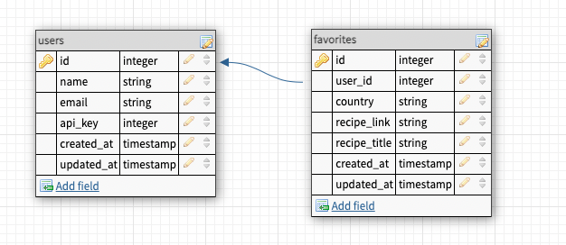

# README

## About
 This app will allow users to search for recipes by country, favorite recipes, and learn more about a particular country.  Additionally, a user can search for tourist sights near a country's capital.

## Learning Goals
* Expose an API that aggregates data from multiple external APIs
* Expose an API that requires an authentication token
* Expose an API for CRUD functionality
* Determine completion criteria based on the needs of other developers
* Test both API consumption and exposure

## Built With


## Gems


## Schema


## Setup
#### API keys
* https://developer.edamam.com/edamam-docs-recipe-api (`app_id`, `app_key`)
* https://restcountries.com/#api-endpoints-v3-all (no API key required)
* https://developers.google.com/youtube/v3/docs (`video_key`) 
* https://unsplash.com/documentation (`image_access_key, image_secret_key`)
* https://apidocs.geoapify.com/docs/places/#categories (`places_key`)

* Clone repo
* `bundle install`
* `bundle exec figaro install`
* Add API keys to  `config/application.yml`
* `rails db:{create,migrate,seed}`

## Endpoints

### Recipes Index 
GET `http://localhost:3000/api/v1/recipes?country=thailand`

Response:
```json
{
    "data": [
        {
            "id": null,
            "type": "recipe",
            "attributes": {
                "title": "Andy Ricker's Naam Cheuam Naam Taan Piip (Palm Sugar Simple Syrup)",
                "url": "https://www.seriouseats.com/recipes/2013/11/andy-rickers-naam-cheuam-naam-taan-piip-palm-sugar-simple-syrup.html",
                "country": "thailand",
                "image": "https://edamam-product-images.s3.amazonaws.com..."
            }
        },
        {
            "id": null,
            "type": "recipe",
            "attributes": {
                "title": "Sriracha",
                "url": "http://www.jamieoliver.com/recipes/vegetables-recipes/sriracha/",
                "country": "thailand",
                "image": "https://edamam-product-images.s3.amazonaws.com/."
            }
        },
        {...},
        {...},
        {...},
        {etc},
    ]
}
```
If the country parameter is either an empty string, or a value that doesn’t return any recipes, response will be an empty array:
```json
{
  "data": []
}
```

### Learning Resources Index 
GET `http://localhost:3000/api/v1/learning_resources?country=laos`

Response:
```json
{
    "data": {
        "id": null,
        "type": "learning_resource",
        "attributes": {
            "country": "laos",
            "video": {
                "title": "A Super Quick History of Laos",
                "youtube_video_id": "uw8hjVqxMXw"
            },
            "images": [
                {
                    "alt_tag": "standing statue and temples landmark during daytime",
                    "url": "https://images.unsplash.com/photo-1528181304800-259b08848526?ixid=MnwzNzg2NzV8MHwxfHNlYXJjaHwxfHx0aGFpbGFuZHxlbnwwfHx8fDE2Njc4Njk1NTA&ixlib=rb-4.0.3"
                },
                {
                    "alt_tag": "five brown wooden boats",
                    "url": "https://images.unsplash.com/photo-1552465011-b4e21bf6e79a?ixid=MnwzNzg2NzV8MHwxfHNlYXJjaHwyfHx0aGFpbGFuZHxlbnwwfHx8fDE2Njc4Njk1NTA&ixlib=rb-4.0.3"
                },
                {
                    "alt_tag": "orange temples during daytime",
                    "url": "https://images.unsplash.com/photo-1563492065599-3520f775eeed?ixid=MnwzNzg2NzV8MHwxfHNlYXJjaHwzfHx0aGFpbGFuZHxlbnwwfHx8fDE2Njc4Njk1NTA&ixlib=rb-4.0.3"
                },
                {...},
                {...},
                {...},
                {etc},
              ]
        }
    }
}
```

If no videos or images are found, respose will return an empty object:
```json
{
  "data": {
      "id": null,
      "type": "learning_resource",
      "attributes": {
          "country": "Nameofcountry", # this value is the value used to search for learning resources
          "video": [],
          "images": []
      }
  }
}
```
### User Create
POST `http://localhost:3000/api/v1/users`

```json
{
  "name": "Athena Dao",
  "email": "athenadao@bestgirlever.com"
}
```

Response:
```json
{
  "data": {
    "type": "user",
    "id": "1",
    "attributes": {
      "name": "Athena Dao",
      "email": "athenadao@bestgirlever.com",
      "api_key": "jgn983hy48thw9begh98h4539h4"
    }
  }
}
```
### Favorites Create
POST `http://localhost:3000/api/v1/favorites`
```json
{
    "api_key": "jgn983hy48thw9begh98h4539h4",
    "country": "thailand",
    "recipe_link": "https://www.tastingtable.com/.....",
    "recipe_title": "Crab Fried Rice (Khaao Pad Bpu)"
}
```
Response:
```json
{
    "success": "Favorite added successfully"
}
```

### Favorites Index
GET `http://localhost:3000/api/v1/favorites`
```json
{
    "api_key": "jgn983hy48thw9begh98h4539h4"
}
```
Response:
```json
{
    "data": [
        {
            "id": "1",
            "type": "favorite",
            "attributes": {
                "recipe_title": "Recipe: Egyptian Tomato Soup",
                "recipe_link": "http://www.thekitchn.com/recipe-egyptian-tomato-soup-weeknight....",
                "country": "egypt",
                "created_at": "2022-11-02T02:17:54.111Z"
            }
        },
        {
            "id": "2",
            "type": "favorite",
            "attributes": {
                "recipe_title": "Crab Fried Rice (Khaao Pad Bpu)",
                "recipe_link": "https://www.tastingtable.com/.....",
                "country": "thailand",
                "created_at": "2022-11-07T03:44:08.917Z"
            }
        }
    ]
 }   
```

### TouristSights Index  

GET `http://localhost:3000/api/v1/tourist_sights?country=United States of America`

Response: 
```json
{
    "data": [
        {
            "id": null,
            "type": "tourist_sight",
            "attributes": {
                "name": "Titan II Launch Facility 533-1",
                "address": "Titan II Launch Facility 533-1, Northwest 110th Street, Butler County, KS 67123, United States of America",
                "place_id": "510eb853df1e4058c059cfaaf468aafd4240f00103f901cd74e3430100000092031e546974616e204949204c61756e636820466163696c697479203533332d31"
            }
        },
        {
            "id": null,
            "type": "tourist_sight",
            "attributes": {
                "name": "Titan II Launch Facility 533-2",
                "address": "Titan II Launch Facility 533-2, US 77, Butler County, KS, United States of America",
                "place_id": "51241e3f0a0d3658c05978ba9f1452f64240f00103f901d074e3430100000092031e546974616e204949204c61756e636820466163696c697479203533332d32"
            }
        }
    ]
}
```
